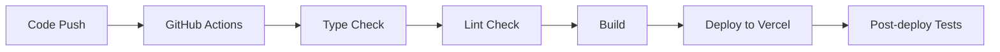

# Protocol Guardian - Internal Documentation 🔧

> **Internal Development Guide** - This document is for developers, maintainers, and contributors working on the Protocol Guardian codebase.

## 📋 Table of Contents
- [Development Environment](#-development-environment)
- [Architecture Overview](#-architecture-overview)
- [Code Organization](#-code-organization)
- [Game Logic Deep Dive](#-game-logic-deep-dive)
- [Blockchain Integration](#-blockchain-integration)
- [Performance Considerations](#-performance-considerations)
- [Testing Strategy](#-testing-strategy)
- [Deployment Pipeline](#-deployment-pipeline)
- [Troubleshooting](#-troubleshooting)
- [Future Roadmap](#-future-roadmap)

## 🛠️ Development Environment

### Required Tools
```bash
# Node.js version management
nvm use 18.17.0  # or latest LTS

# Package manager
npm install -g pnpm@latest

# Development dependencies
pnpm install
```

### Environment Variables
```env
# .env.local (development)
NODE_ENV=development
NEXT_PUBLIC_FORCE_MAINNET=false
NEXT_PUBLIC_DEBUG_MODE=true

# .env.production (deployment)
NODE_ENV=production
NEXT_PUBLIC_FORCE_MAINNET=true
NEXT_PUBLIC_DEBUG_MODE=false
```

### Development Commands
```bash
# Core development
pnpm dev                 # Start dev server with hot reload
pnpm build               # Production build
pnpm start               # Start production server
pnpm lint                # ESLint check
pnpm type-check          # TypeScript validation

# Game-specific
pnpm seed:events         # Seed sample events/decisions
pnpm analyze:bundle      # Bundle size analysis
pnpm test:game-logic     # Test game mechanics
```

## 🏗️ Architecture Overview

### High-Level Architecture
```
┌─────────────────┐    ┌─────────────────┐    ┌─────────────────┐
│   Next.js App   │    │  Stacks Auth    │    │  Game Engine    │
│   (UI Layer)    │◄──►│   (Web3)        │◄──►│   (Logic)       │
└─────────────────┘    └─────────────────┘    └─────────────────┘
         │                       │                       │
         ▼                       ▼                       ▼
┌─────────────────┐    ┌─────────────────┐    ┌─────────────────┐
│  Component Lib  │    │ Blockchain API  │    │  State Mgmt     │
│  (Radix/shadcn) │    │  (@stacks/*)    │    │  (Hooks/Context)│
└─────────────────┘    └─────────────────┘    └─────────────────┘
```

### Data Flow
```
User Action → Component → Hook → Game State → Side Effects
     ↑                                             ↓
UI Update ←── State Change ←── Game Logic ←── Event Processing
```

### Key Design Patterns
- **Custom Hooks**: Encapsulate game logic and side effects
- **Context Providers**: Global state management for auth and game
- **Component Composition**: Small, focused components with clear props
- **Event-Driven Architecture**: Decision consequences trigger state changes
- **Lazy Loading**: Performance optimization for heavy components

## 📁 Code Organization

### Component Hierarchy
```
components/
├── ui/                    # Base UI components (shadcn/ui)
│   ├── button.tsx         # Reusable button component
│   ├── card.tsx           # Card container component
│   └── ...                # Other UI primitives
├── accessibility/         # Accessibility-specific components
│   ├── error-boundary.tsx # React error boundary
│   ├── focus-manager.tsx  # Focus management
│   └── screen-reader-*.tsx # Screen reader support
├── performance/           # Performance optimization components
│   ├── lazy-components.tsx # Code-split components
│   └── loading-states.tsx # Loading skeletons
├── game-*.tsx            # Core game UI components
├── wallet-connect.tsx    # Stacks wallet integration
└── blockchain-*.tsx      # Blockchain feature components
```

### Hook Architecture
```typescript
// Core game state hook
useGameState() {
  // Game metrics, decisions, crises
  return { gameState, makeDecision, advanceTime, ... }
}

// Blockchain integration hook
useBlockchainGameState() {
  // Save/load game state to/from blockchain
  return { saveGameState, loadGameState, ... }
}

// Authentication hook
useStacksAuth() {
  // Wallet connection and user session
  return { isSignedIn, connectWallet, userData, ... }
}
```

### State Management Strategy
- **Local State**: Component-specific UI state (useState)
- **Game State**: Central game logic (useGameState hook)
- **Auth State**: User authentication (React Context)
- **Blockchain State**: Web3 interactions (custom hooks)

## 🎮 Game Logic Deep Dive

### Game State Structure
```typescript
interface GameState {
  // Core metrics (0-100)
  networkHealth: number
  publicConfidence: number  
  techAdvancement: number
  
  // Progression
  currentYear: number
  currentMonth: number
  gamePhase: 'intro' | 'era1' | 'era2' | 'era3' | 'era4' | 'era5' | 'ending'
  termProgress: number
  
  // Decision tracking
  decisions: CompletedDecision[]
  currentCrisis?: Crisis
  unresolvedCrises: UnresolvedCrisis[]
  
  // Achievements
  completedLessons: string[]
  endingType?: 'sovereign' | 'progressive' | 'pragmatic' | 'disruptive'
}
```

### Decision Processing Algorithm
```typescript
// 1. Player selects decision option
const processDecision = (decision: Decision, option: DecisionOption) => {
  // 2. Apply immediate consequences
  option.consequences.forEach(consequence => {
    updateMetric(consequence.type, consequence.change)
  })
  
  // 3. Record decision history
  addToDecisionHistory(decision, option)
  
  // 4. Check for triggered events
  checkForTriggeredEvents(decision, option)
  
  // 5. Update game phase if needed
  checkForPhaseTransition()
  
  // 6. Evaluate ending conditions
  checkForGameEnding()
}
```

### Crisis Management System
```typescript
interface Crisis {
  id: string
  title: string
  description: string
  era: number                    // Which era this crisis appears
  timeLimit: number             // Days to respond
  decisions: Decision[]         // Related decision options
  unresolvedPenalty?: {         // Penalty if not resolved
    type: MetricType
    change: number
  }
}

// Crisis lifecycle
const crisisLifecycle = {
  trigger: () => setCrisisActive(),
  respond: (decisions) => processDecisions(decisions),
  resolve: () => clearActiveCrisis(),
  timeout: () => applyUnresolvedPenalty()
}
```

### Era Transition Logic
```typescript
const getGamePhase = (year: number): GamePhase => {
  const yearInTerm = year - 2035 + 1
  if (yearInTerm <= 1) return 'era1'      // 2035
  if (yearInTerm <= 2) return 'era2'      // 2036
  if (yearInTerm <= 3) return 'era3'      // 2037
  if (yearInTerm <= 4) return 'era4'      // 2038
  if (yearInTerm <= 5) return 'era5'      // 2039
  return 'ending'                         // 2040+
}
```

### Ending Determination Algorithm
```typescript
const determineEnding = (gameState: GameState): EndingType => {
  const { networkHealth, publicConfidence, techAdvancement } = gameState
  const avgScore = (networkHealth + publicConfidence + techAdvancement) / 3
  
  // Priority-based ending determination
  if (networkHealth >= 75) return 'sovereign'        // Bitcoin maximalist
  if (techAdvancement >= 75) return 'progressive'    // Layer 2 catalyst  
  if (avgScore >= 60) return 'pragmatic'             // Balanced approach
  return 'disruptive'                                 // Poor performance
}
```

## 🔗 Blockchain Integration

### Stacks.js Integration Points
```typescript
// 1. Authentication
authenticate({
  appDetails: { name: 'Protocol Guardian', icon: '/logo.svg' },
  redirectTo: '/',
  onFinish: () => window.location.reload(),
  userSession
})

// 2. User Session Management  
const userSession = new UserSession({ appConfig })
const userData = userSession.loadUserData()

// 3. Network Configuration
const network = testnet ? STACKS_TESTNET : STACKS_MAINNET
```

### Current Implementation (Demo Mode)
```typescript
// Simulated blockchain storage using localStorage
const saveGameState = async (gameState: GameState): Promise<boolean> => {
  try {
    const key = `game_save_${userAddress}`
    localStorage.setItem(key, JSON.stringify(gameState))
    return true
  } catch (error) {
    console.error('Save failed:', error)
    return false
  }
}
```

### Production Blockchain Integration (Planned)
```typescript
// Smart contract interaction
const saveToBlockchain = async (gameState: GameState) => {
  const txOptions = {
    contractAddress: 'SP...CONTRACT_ADDRESS',
    contractName: 'protocol-guardian',
    functionName: 'save-game-state',
    functionArgs: [gameStateToClarity(gameState)],
    network,
    anchorMode: AnchorMode.Any,
  }
  
  return await makeContractCall(txOptions)
}
```

### Achievement System
```typescript
interface Achievement {
  id: string
  title: string
  description: string
  condition: (gameState: GameState) => boolean
  unlocked: boolean
  timestamp?: number
}

// Achievement checking
const checkAchievements = (gameState: GameState) => {
  achievements.forEach(achievement => {
    if (!achievement.unlocked && achievement.condition(gameState)) {
      unlockAchievement(achievement.id)
      showAchievementNotification(achievement)
    }
  })
}
```

## ⚡ Performance Considerations

### Code Splitting Strategy
```typescript
// Lazy load heavy components
const LazyDynamicEventsFeed = lazy(() => 
  import('./dynamic-events-feed').then(m => ({ default: m.DynamicEventsFeed }))
)

// Suspense boundaries for loading states
<Suspense fallback={<LoadingSkeleton />}>
  <LazyDynamicEventsFeed />
</Suspense>
```

### State Optimization
```typescript
// Memoize expensive calculations
const gameMetrics = useMemo(() => 
  calculateGameMetrics(gameState), [gameState.networkHealth, gameState.publicConfidence, gameState.techAdvancement]
)

// Debounce frequent updates
const debouncedSave = useCallback(
  debounce(saveGameState, 1000), [saveGameState]
)
```

### Bundle Size Management
- **Tree Shaking**: Only import used functions from libraries
- **Dynamic Imports**: Lazy load non-critical components
- **Image Optimization**: Use Next.js Image component (currently disabled)
- **Bundle Analysis**: Regular analysis with `webpack-bundle-analyzer`

## 🧪 Testing Strategy

### Testing Pyramid
```
┌─────────────────┐
│   E2E Tests     │  ← Game flow, wallet integration
├─────────────────┤
│ Integration     │  ← Component + hook interactions
├─────────────────┤
│  Unit Tests     │  ← Game logic, utility functions
└─────────────────┘
```

### Test Categories
- **Game Logic Tests**: Decision processing, state transitions
- **Component Tests**: UI behavior, accessibility
- **Integration Tests**: Wallet connection, blockchain operations
- **E2E Tests**: Complete game playthroughs

### Testing Tools (Planned)
- **Jest**: Unit testing framework
- **React Testing Library**: Component testing
- **Playwright**: E2E testing
- **Stacks Testing**: Blockchain interaction testing

## 🚀 Deployment Pipeline

### Build Process


### Environment Configuration
```typescript
// next.config.mjs
const nextConfig = {
  eslint: { ignoreDuringBuilds: true },     // Rapid prototyping
  typescript: { ignoreBuildErrors: true },  // Flexible development
  images: { unoptimized: true },            // Compatibility
  experimental: {
    serverComponentsExternalPackages: ['@stacks/connect']
  }
}
```

### Deployment Targets
- **Development**: Vercel Preview (automatic on PR)
- **Staging**: Vercel Production (testnet configuration)
- **Production**: Vercel Production (mainnet configuration)

## 🐛 Troubleshooting

### Common Issues

#### Wallet Connection Problems
```typescript
// Debug wallet connection
const debugWalletConnection = () => {
  console.log('User Session:', userSession)
  console.log('Is Signed In:', userSession?.isUserSignedIn())
  console.log('User Data:', userSession?.loadUserData())
  console.log('Network:', network)
}
```

#### Game State Issues
```typescript
// Debug game state
const debugGameState = () => {
  console.log('Current Game State:', gameState)
  console.log('Pending Decisions:', pendingDecisions)
  console.log('Current Crisis:', gameState.currentCrisis)
  console.log('Phase:', gameState.gamePhase)
}
```

#### Performance Issues
```typescript
// Monitor component renders
const ComponentWithDebug = () => {
  const renderCount = useRef(0)
  renderCount.current++
  console.log(`Component rendered ${renderCount.current} times`)
  
  return <YourComponent />
}
```

### Error Monitoring
- **Client-side Errors**: Error boundaries and logging
- **Build Errors**: Next.js build logs
- **Runtime Errors**: Browser console and Vercel logs

## 🔮 Future Roadmap

### Phase 1: Core Blockchain Integration
- [ ] Deploy Clarity smart contracts for game state storage
- [ ] Implement actual blockchain save/load functionality
- [ ] Add transaction confirmation UI
- [ ] Integrate STX payment for premium features

### Phase 2: Enhanced Game Content
- [ ] Expand Bitcoin/Stacks historical scenarios
- [ ] Add more crisis events and decision trees
- [ ] Implement dynamic consequence system
- [ ] Create educational content integration

### Phase 3: Community Features
- [ ] Multiplayer decision making
- [ ] Community leaderboards
- [ ] Shared game outcomes
- [ ] Social sharing of achievements

### Phase 4: Advanced Features
- [ ] NFT achievement system
- [ ] STX rewards for achievements
- [ ] DAO governance for game updates
- [ ] Mobile app development

### Phase 5: Analytics & Optimization
- [ ] Player behavior analytics
- [ ] A/B testing framework
- [ ] Performance monitoring
- [ ] Accessibility improvements

## 📊 Metrics & Monitoring

### Key Performance Indicators
- **User Engagement**: Session duration, completion rate
- **Technical Metrics**: Load time, error rate, wallet connection success
- **Game Metrics**: Decision completion rate, crisis resolution rate
- **Blockchain Metrics**: Transaction success rate, gas costs

### Analytics Implementation
```typescript
// Track game events
const trackGameEvent = (event: string, data: any) => {
  analytics.track(event, {
    userId: userData?.profile?.stxAddress,
    gameState: gameState.gamePhase,
    timestamp: Date.now(),
    ...data
  })
}
```

---

## 🔒 Security Considerations

### Wallet Security
- **No Private Key Storage**: All sensitive operations handled by wallet
- **Session Management**: Secure user session handling
- **Network Validation**: Verify correct network (testnet/mainnet)

### Data Protection
- **Local Storage**: Minimal sensitive data storage
- **Blockchain Data**: Public by design, no sensitive information
- **User Privacy**: Optional wallet connection

---

## 📚 Development Resources

### Documentation Links
- [Next.js 14 Documentation](https://nextjs.org/docs)
- [Stacks.js Reference](https://docs.hiro.so/en/reference/stacks.js)
- [Radix UI Components](https://www.radix-ui.com/primitives)
- [Tailwind CSS Docs](https://tailwindcss.com/docs)

### Code Standards
- **TypeScript**: Strict mode enabled
- **ESLint**: Custom configuration for React/Next.js
- **Prettier**: Code formatting (if configured)
- **Conventional Commits**: Standardized commit messages

---

*This internal documentation is maintained by the development team and should be updated with each major feature addition or architectural change.*